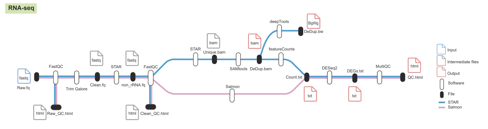

# RNA-seq Pipeline

This is a unified RNA-seq pipeline designed to run a complete analysis from raw FASTQ files to differential expression results. It leverages Singularity for reproducibility and is capable of batch processing multiple samples.

## Workflow Diagram


## Features

-   **Single Command Execution**: Runs the entire workflow, including per-sample processing and final DEG analysis, with one command.
-   **Two Modes**: Supports both alignment-based (`align`) and alignment-free (`quant`) workflows.
    -   **`align` mode**: STAR -> samtools -> featureCounts -> DESeq2. Generates BAM, BAI, BigWig, and count files.
    -   **`quant` mode**: Salmon -> DESeq2. Generates transcript quantifications.
-   **Reproducible**: All software is encapsulated within a Singularity container (`RNA.sif`).

## Requirements

1.  **Singularity**: Must be installed on your system. Follow the installation guide at: https://docs.sylabs.io/guides/3.0/user-guide/installation.html
2.  **Pipeline Files**:
    -   `run_pipeline.sh`
    -   `RNA.sif` (the Singularity container)
3.  **Reference Data**: A directory containing all necessary reference files (STAR indices, Salmon index, GTF annotation, etc.).

## Setup

### 1. Prepare the Sample Sheet

This is the most critical input file. Create a CSV file named `samplesheet.csv`.

-   `sample`: A unique identifier for the sample (e.g., `Control_Rep1`). This name will be used for output subdirectories.
-   `condition`: The experimental group for the sample (e.g., `Control`, `Treated`). This is used for the DESeq2 design.
-   `fastq1_path`: The **absolute path** to the Read 1 FASTQ file.
-   `fastq2_path`: The **absolute path** to the Read 2 FASTQ file.

**Example `samplesheet.csv`:**

```csv
sample,condition,fastq1_path,fastq2_path
Control_Rep1,Control,/path/to/data/Control_Rep1_R1.fastq.gz,/path/to/data/Control_Rep1_R2.fastq.gz
Control_Rep2,Control,/path/to/data/Control_Rep2_R1.fastq.gz,/path/to/data/Control_Rep2_R2.fastq.gz
Treated_Rep1,Treated,/path/to/data/Treated_Rep1_R1.fastq.gz,/path/to/data/Treated_Rep1_R2.fastq.gz
Treated_Rep2,Treated,/path/to/data/Treated_Rep2_R1.fastq.gz,/path/to/data/Treated_Rep2_R2.fastq.gz
```

### 2. Prepare the Reference Genome

The pipeline requires several pre-built reference files. Below are the steps to generate them for the human hg38 genome using GENCODE annotations.

#### Create Reference Directory

Create a dedicated directory for all reference data:

```bash
mkdir -p reference_data
cd reference_data
```

#### Common Reference Files for Both Modes

Both `align` and `quant` modes require the following base files:

**Download Reference Files:**

```bash
# Download Genome FASTA
wget https://ftp.ebi.ac.uk/pub/databases/gencode/Gencode_human/release_46/GRCh38.primary_assembly.genome.fa.gz

# Download GTF Annotation
wget https://ftp.ebi.ac.uk/pub/databases/gencode/Gencode_human/release_46/gencode.v46.primary_assembly.annotation.gtf.gz

# Unzip the files
gunzip GRCh38.primary_assembly.genome.fa.gz
gunzip gencode.v46.primary_assembly.annotation.gtf.gz

# Rename annotation file for consistency
mv gencode.v46.primary_assembly.annotation.gtf annotation.gtf
```

#### Reference Files for Align Mode

The `align` mode requires STAR indices for both genome alignment and rRNA depletion.

##### Create rRNA Reference:

```bash
# Create a list of rRNA intervals from the GTF for STAR's rRNA index
grep 'gene_type "rRNA"' annotation.gtf > gencode.v46.rRNA.gtf
```

##### Build STAR Indices:

```bash
# Build the main Genome Index
mkdir -p star_genome_index
STAR --runThreadN 16 \
     --runMode genomeGenerate \
     --genomeDir ./star_genome_index \
     --genomeFastaFiles GRCh38.primary_assembly.genome.fa \
     --sjdbGTFfile annotation.gtf \
     --sjdbOverhang 100

# Build the rRNA Index
mkdir -p star_rrna_index
STAR --runThreadN 16 \
     --runMode genomeGenerate \
     --genomeDir ./star_rrna_index \
     --genomeFastaFiles GRCh38.primary_assembly.genome.fa \
     --sjdbGTFfile gencode.v46.rRNA.gtf \
     --sjdbOverhang 100
```

The final reference structure for `align` mode:

```
reference_data/
├── annotation.gtf
├── GRCh38.primary_assembly.genome.fa
├── gencode.v46.rRNA.gtf
├── star_genome_index/
└── star_rrna_index/
```

#### Reference Files for Quant Mode

The `quant` mode requires Salmon index and transcript-to-gene mapping.

##### Download Transcriptome FASTA:

```bash
# Download transcriptome FASTA file from GENCODE
wget https://ftp.ebi.ac.uk/pub/databases/gencode/Gencode_human/release_46/gencode.v46.transcripts.fa.gz
gunzip gencode.v46.transcripts.fa.gz
```

##### Build Salmon Index:

```bash
# Build the Salmon Index
mkdir -p salmon_index
salmon index -t gencode.v46.transcripts.fa -i ./salmon_index -k 31
```

##### Create Transcript-to-Gene Map:

```bash
# Create the transcript-to-gene map (t2g.tsv)
# This command extracts transcript and gene IDs from the transcriptome FASTA header
grep "^>" gencode.v46.transcripts.fa \
  | cut -d'|' -f1,2 \
  | sed 's/>//g' \
  | sed 's/\.[0-9]*//g' \
  | tr '|' '\t' > t2g.tsv
```

The final reference structure for `quant` mode:

```
reference_data/
├── annotation.gtf
├── gencode.v46.transcripts.fa
├── t2g.tsv
└── salmon_index/
```

## Running

Execute the pipeline using a single command, providing the sample sheet, output directory, reference directory, and desired mode.

### Command Parameters

- `-s`: Path to the sample sheet CSV file (required)
- `-o`: Output directory path where results will be saved (required)
- `-r`: Reference data directory containing indices and annotation files (required)
- `-m`: Analysis mode, either `align` or `quant` (required)
- `-c`: Path to the RNA.sif Singularity container file (required)
- `-L`: Control condition name for differential expression analysis (optional,If unset, DESeq2 uses alphabetical order)
- `-t`: Number of threads to use for processing (optional, default: 8)
- `-g`: Path to transcript-to-gene mapping file (required only for `quant` mode)

### Example Commands

**Example for `align` mode:**

```bash
./run_pipeline.sh \
  -s ./samplesheet.csv \
  -o ./project_results \
  -r ./reference_data \
  -m align \
  -c ./RNA.sif \
  -L Control \
  -t 8
```

**Example for `quant` mode:**

Note the additional `-g` flag, which is required for this mode to provide the transcript-to-gene mapping file.

```bash
./run_pipeline.sh \
  -s ./samplesheet.csv \
  -o ./project_results \
  -r ./reference_data \
  -m quant \
  -c ./RNA.sif \
  -g ./reference_data/t2g.tsv \
  -L Control \
  -t 8
```

## Output Structure

After the pipeline completes, the output directory will be organized differently depending on the mode used.

### Align Mode Output

```
./project_results/
├── Control_Rep1/
│   ├── Control_Rep1.dedup.bam         # Final processed BAM file
│   ├── Control_Rep1.dedup.bam.bai     # BAM index file
│   ├── Control_Rep1.bw                # BigWig signal track
├── Control_Rep2/
│   ├── Control_Rep2.dedup.bam
│   ├── Control_Rep2.dedup.bam.bai
│   ├── Control_Rep2.bw
├── Treated_Rep1/
│   ├── Treated_Rep1.dedup.bam
│   ├── Treated_Rep1.dedup.bam.bai
│   ├── Treated_Rep1.bw
├── Treated_Rep2/
│   ├── Treated_Rep2.dedup.bam
│   ├── Treated_Rep2.dedup.bam.bai
│   ├── Treated_Rep2.bw
├── multiqc_report/
│   └── multiqc_report.html            # Aggregated QC report for all samples
├── deg_results.txt                    # Differential expression gene list from DESeq2
└── normalized_counts.csv              # Normalized counts matrix from DESeq2
```

### Quant Mode Output

```
./project_results/
├── multiqc_report/
│   └── multiqc_report.html            # Aggregated QC report for all samples
├── deg_results.txt                    # Differential expression gene list from DESeq2
└── normalized_counts.csv              # Normalized counts matrix from DESeq2
```

## Video Tutorials

### Align Mode Tutorial
Watch this video tutorial to see a complete walkthrough of running the pipeline in `align` mode:

[

### Quant Mode Tutorial  
Watch this video tutorial to see a complete walkthrough of running the pipeline in `quant` mode:

[
